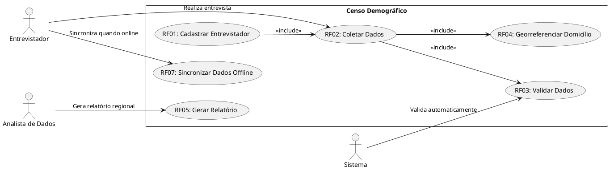
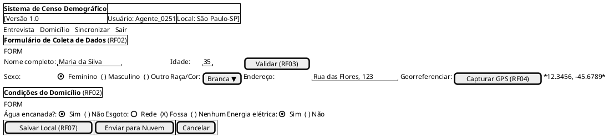
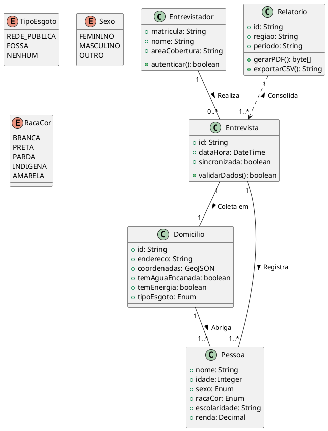

# 06 - **Levantamento de Requisitos e Casos de Uso**

## **Cenário de Desenvolvimento para um Censo Demográfico**  

### **1. Contexto e Objetivo**  

O **Censo Demográfico** é uma pesquisa ampla que coleta dados sobre a população de um país/região, incluindo informações como:  

- Dados demográficos (idade, sexo, raça/cor, estado civil).  
- Condições socioeconômicas (renda, escolaridade, emprego).  
- Infraestrutura domiciliar (acesso a água, esgoto, energia).  
- Mobilidade e migração.  

**Objetivo do Projeto:**  
Desenvolver um sistema (digital ou híbrido) para coleta, processamento e análise de dados censitários, garantindo precisão, segurança e eficiência.  

---  

### **2. Stakeholders (Partes Interessadas)**  

- **Governo/IBGE (Instituto Brasileiro de Geografia e Estatística):** Principal responsável pela execução.  
- **Entrevistadores/Agentes de campo:** Coletam dados diretamente da população.  
- **População-alvo:** Pessoas entrevistadas.  
- **Equipe de TI:** Desenvolve e mantém o sistema.  
- **Analistas de dados:** Processam e interpretam os dados.  
- **Órgãos públicos:** Utilizam os dados para políticas públicas.  

---  

### **3. Levantamento de Requisitos**  

#### **3.1 Requisitos Funcionais (RF)**  

| ID  | Requisito | Descrição |  
|-----|-----------|-----------|  
| RF01 | Cadastro de Entrevistadores | Sistema deve permitir o cadastro e autenticação de agentes censitários. |  
| RF02 | Coleta de Dados | Interface para inserção de dados demográficos (formulário digital ou offline). |  
| RF03 | Validação de Dados | Verificação automática de inconsistências (ex.: idade inválida). |  
| RF04 | Georreferenciamento | Registrar localização exata do domicílio (GPS). |  
| RF05 | Geração de Relatórios | Exportar dados em formatos como CSV, PDF ou para BI. |  
| RF06 | Segurança e Confidencialidade | Criptografia de dados e acesso restrito. |  
| RF07 | Sincronização Offline/Online | Armazenamento local com posterior sincronização. |  

#### **3.2 Requisitos Não-Funcionais (RNF)**  

| ID  | Requisito | Descrição |  
|-----|-----------|-----------|  
| RNF01 | Performance | Sistema deve responder em <2 segundos por formulário. |  
| RNF02 | Escalabilidade | Suportar milhões de registros simultâneos. |  
| RNF03 | Usabilidade | Interface intuitiva para entrevistadores com baixa familiaridade tecnológica. |  
| RNF04 | Conformidade Legal | Adequação à LGPD (proteção de dados pessoais). |  

---  

### **4. Casos de Uso (Exemplos)**  

#### **Caso de Uso 1: Realizar Entrevista**  

- **Ator:** Entrevistador.  
- **Pré-condição:** Entrevistador autenticado no sistema.  
- **Fluxo Principal:**  
  1. Entrevistador seleciona "Nova Entrevista".  
  2. Sistema exibe formulário com campos obrigatórios (nome, idade, endereço, etc.).  
  3. Entrevistador preenche os dados e envia.  
  4. Sistema valida e armazena os dados.  

- **Fluxos Alternativos:**  
  - Dados inválidos → Sistema solicita correção.  
  - Sem conexão → Dados salvos localmente e sincronizados depois.  

#### **Caso de Uso 2: Gerar Relatório Regional**  

- **Ator:** Analista de dados.  
- **Pré-condição:** Dados coletados disponíveis.  
- **Fluxo Principal:**  
  1. Analista seleciona região e período.  
  2. Sistema processa e exibe dados consolidados (ex.: população por faixa etária).  
  3. Analista exporta para Excel/PDF.  

---  

### **5. Técnicas de Levantamento de Requisitos**  

- **Workshops com IBGE e entrevistadores** para entender necessidades reais.  
- **Prototipação** de interfaces para validação com usuários.  
- **Análise de Censos Anteriores** para identificar pontos de melhoria.  
- **Questionários** com a população para avaliar aceitação de métodos digitais.  

---  

### **6. Riscos e Mitigações**  

| Risco | Mitigação |  
|-------|-----------|  
| Resistência à tecnologia | Treinamento presencial para entrevistadores. |  
| Falha na coleta offline | Sincronização automática quando houver conexão. |  
| Vazamento de dados | Criptografia e acesso por autenticação forte. |  

---  

### **7. Conclusão**  

Este cenário fornece uma base para o desenvolvimento de um sistema de censo, alinhando requisitos técnicos, operacionais e legais. A priorização deve considerar:  

1. **Usabilidade** para entrevistadores em campo.  
2. **Confiabilidade** dos dados coletados.  
3. **Escalabilidade** para grandes volumes.  

Próximos passos:  

- Detalhar diagramas UML (casos de uso, fluxos).  
- Validar protótipos com usuários reais.  

---  

Aqui está o diagrama de **Casos de Uso (Use Case)** em **PlantUML** para o sistema de Censo Demográfico, baseado no cenário descrito:



### **Explicação do Diagrama:**

1. **Atores Principais:**  
   - **Entrevistador:** Responsável por coletar dados (RF02) e sincronizá-los (RF07).  
   - **Analista de Dados:** Gera relatórios (RF05).  
   - **Sistema:** Executa validações automáticas (RF03).  

2. **Casos de Uso:**  
   - **RF01 → RF02:** O entrevistador deve estar cadastrado (RF01) para coletar dados (RF02).  
   - **RF02 inclui RF03 e RF04:** Durante a coleta, o sistema valida dados (RF03) e registra a localização (RF04).  
   - **RF07:** Funcionalidade crítica para áreas sem internet.  

3. **Relacionamentos:**  
   - `<<include>>` indica dependência obrigatória entre casos de uso.  

---  

Aqui está um **protótipo de interface (wireframe)** usando o **plugin Salt** do PlantUML, representando a tela de coleta de dados do Censo Demográfico conforme os casos de uso anteriores:



---  

### **Explicação do Protótipo (Salt UML):**

1. **Cabeçalho:**  
   - Mostra o nome do sistema, versão, usuário logado (entrevistador) e localização.

2. **Abas Principais (RF02):**  
   - **Entrevista** (ativo), Domicílio, Sincronizar (RF07), Sair.

3. **Formulário de Dados Pessoais:**  
   - Campos obrigatórios (Nome, Idade, Sexo, Raça/Cor).  
   - Botão "Validar" (RF03) para checar inconsistências.  
   - Georreferenciamento (RF04) com coordenadas GPS.  

4. **Condições do Domicílio:**  
   - Checkboxes para infraestrutura básica (água, esgoto, energia).  

5. **Botões de Ação:**  
   - **Salvar Local** (RF07): Permite armazenamento offline.  
   - **Enviar para Nuvem**: Sincroniza quando há conexão.  

---  

### **Visualização do Wireframe:**

O Salt gera um layout semelhante a este:  


---  

### **Como Melhorar?**  

- **Adicionar Validação em Tempo Real** (ex.: idade não pode ser > 120).  
- **Ícones** para ações (GPS, sincronização).  
- **Modo Acessível** (alto contraste, leitor de tela).  

---  

Aqui está o **diagrama de classes conceitual** em **PlantUML** para o sistema de Censo Demográfico, alinhado com os requisitos e casos de uso anteriores:



---  

### **Explicação do Diagrama Classe:**

#### **Classes Principais:**

1. **`Entrevistador`**  
   - Atributos: `matricula`, `nome`, `areaCobertura`.  
   - Método: `autenticar()` (para login no sistema).  

2. **`Domicilio`**  
   - Atributos: `endereco`, `coordenadas` (georreferenciamento – RF04), `temAguaEncanada`, etc.  
   - Relacionamento com `Pessoa` (um domicílio pode abrigar várias pessoas).  

3. **`Entrevista`**  
   - Atributos: `dataHora`, `sincronizada` (RF07 – offline/online).  
   - Método: `validarDados()` (RF03 – checa inconsistências).  

4. **`Pessoa`**  
   - Atributos demográficos: `idade`, `sexo`, `racaCor`, `escolaridade`, etc.  

5. **`Relatorio`**  
   - Métodos: `gerarPDF()`, `exportarCSV()` (RF05 – geração de relatórios).  

#### **Relacionamentos:**

- **`Entrevistador → Entrevista`**: Um entrevistador realiza múltiplas entrevistas.  
- **`Domicilio → Pessoa`**: Composição (um domicílio contém pessoas).  
- **`Entrevista → Domicilio/Pessoa`**: Agregação (a entrevista registra dados dessas classes).  
- **`Relatorio → Entrevista`**: Dependência (consolida dados de entrevistas).  

#### **Enums:**  

- Definem opções padronizadas para campos como `sexo`, `racaCor` e `tipoEsgoto`.  

---  

Aqui está a implementação em **Python** das classes do diagrama conceitual do Censo Demográfico, seguindo boas práticas de POO (incluindo type hints e enums):

```python
from datetime import datetime
from enum import Enum
from typing import List, Optional, Dict, Any
from pydantic import BaseModel  # Para validação de dados (opcional)

# --- Enums ---
class TipoEsgoto(str, Enum):
    REDE_PUBLICA = "Rede Pública"
    FOSSA = "Fossa"
    NENHUM = "Nenhum"

class Sexo(str, Enum):
    FEMININO = "Feminino"
    MASCULINO = "Masculino"
    OUTRO = "Outro"

class RacaCor(str, Enum):
    BRANCA = "Branca"
    PRETA = "Preta"
    PARDA = "Parda"
    INDIGENA = "Indígena"
    AMARELA = "Amarela"

# --- Classes Principais ---
class Entrevistador:
    def __init__(self, matricula: str, nome: str, area_cobertura: str):
        self.matricula = matricula
        self.nome = nome
        self.area_cobertura = area_cobertura

    def autenticar(self, senha: str) -> bool:
        # Lógica fictícia de autenticação
        return senha == f"{self.matricula}@censo"

class Domicilio:
    def __init__(
        self,
        id: str,
        endereco: str,
        coordenadas: Dict[str, float],
        tem_agua_encanada: bool,
        tem_energia: bool,
        tipo_esgoto: TipoEsgoto
    ):
        self.id = id
        self.endereco = endereco
        self.coordenadas = coordenadas
        self.tem_agua_encanada = tem_agua_encanada
        self.tem_energia = tem_energia
        self.tipo_esgoto = tipo_esgoto

class Pessoa:
    def __init__(
        self,
        nome: str,
        idade: int,
        sexo: Sexo,
        raca_cor: RacaCor,
        escolaridade: str,
        renda: float
    ):
        self.nome = nome
        self.idade = idade
        self.sexo = sexo
        self.raca_cor = raca_cor
        self.escolaridade = escolaridade
        self.renda = renda

class Entrevista:
    def __init__(self, id: str, entrevistador: Entrevistador, domicilio: Domicilio):
        self.id = id
        self.data_hora = datetime.now()
        self.sincronizada = False
        self.entrevistador = entrevistador
        self.domicilio = domicilio
        self.pessoas: List[Pessoa] = []

    def adicionar_pessoa(self, pessoa: Pessoa):
        self.pessoas.append(pessoa)

    def validar_dados(self) -> bool:
        return all([
            self.domicilio.id,
            len(self.pessoas) > 0,
            all(p.idade > 0 for p in self.pessoas)
        ])

class Relatorio:
    def __init__(self, id: str, regiao: str, periodo: str):
        self.id = id
        self.regiao = regiao
        self.periodo = periodo

    def gerar_pdf(self, entrevistas: List[Entrevista]) -> bytes:
        # Simulação: gerar PDF fictício
        return f"PDF do relatório {self.id}".encode()

    def exportar_csv(self, entrevistas: List[Entrevista]) -> str:
        # Simulação: gerar CSV fictício
        return "nome,idade,sexo\n" + "\n".join(
            f"{p.nome},{p.idade},{p.sexo.value}"
            for entrevista in entrevistas
            for p in entrevista.pessoas
        )

# --- Exemplo de Uso ---
if __name__ == "__main__":
    # 1. Criar entrevistador
    entrevistador = Entrevistador(
        matricula="12345",
        nome="Maria Silva",
        area_cobertura="São Paulo"
    )

    # 2. Criar domicílio
    domicilio = Domicilio(
        id="CASA_001",
        endereco="Rua das Flores, 123",
        coordenadas={"lat": -23.5505, "lng": -46.6333},
        tem_agua_encanada=True,
        tem_energia=True,
        tipo_esgoto=TipoEsgoto.REDE_PUBLICA
    )

    # 3. Criar entrevista e adicionar pessoas
    entrevista = Entrevista("ENT_001", entrevistador, domicilio)
    entrevista.adicionar_pessoa(Pessoa(
        nome="João da Silva",
        idade=35,
        sexo=Sexo.MASCULINO,
        raca_cor=RacaCor.PARDA,
        escolaridade="Ensino Médio",
        renda=2500.0
    ))

    # 4. Validar e gerar relatório
    if entrevista.validar_dados():
        relatorio = Relatorio("REL_2023", "Sudeste", "2023")
        csv = relatorio.exportar_csv([entrevista])
        print(csv)
```

---  

### **Principais Características:**

1. **Enums**:  
   - `TipoEsgoto`, `Sexo`, `RacaCor` garantem valores padronizados.

2. **Classes**:  
   - **`Entrevistador`**: Gerencia autenticação.  
   - **`Domicilio`**: Armazena dados georreferenciados.  
   - **`Pessoa`**: Contém atributos demográficos.  
   - **`Entrevista`**: Agrega pessoas e valida dados.  
   - **`Relatorio`**: Gera saídas em PDF/CSV.

3. **Type Hints**:  
   - Tipos estáticos para melhor legibilidade e autocomplete.

4. **Exemplo Prático**:  
   - Demonstra como criar objetos e relacioná-los.

---  

### **Como Executar?**

1. Salve como `censo.py`.
2. Execute com:

```bash
   python censo.py
```

   Saída (CSV exemplo):

```bash
   nome,idade,sexo
   João da Silva,35,Masculino
```

---  

### **Melhorias Possíveis:**

- **Persistência**: Adicionar SQLAlchemy para salvar em banco de dados.
- **API REST**: Usar FastAPI para expor endpoints.
- **Validação Avançada**: Integrar `pydantic` para validação de campos.
